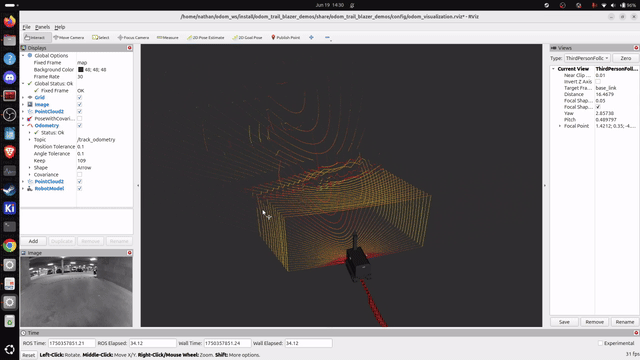

# Odometry Workspace for Trailblazer Robot
This workspace contains ROS 2 packages for odometry using the Trailblazer robot and handheld platform from the 2023 Hilti SLAM Challenge. These are operated on construction sites which provides a unique challenge with textureless concrete little color variation and repeating identical structures, and variouslighting challenges as many rooms are dark while adjacent ones are lit by the outdoors.

## lib dependencies
requires oneapi TBB, eigen, and sophus outside of ros2

## TODO
- [x] IMU ODOM
- [x] lid_odom working in  near real time
- [ ] scent the lidar odometry with another odometry source to improve performance and its ability to recover (current focus)
- [ ] python bindings with cython to enable an augmented random search for lidar_odometry (refactor)
- [ ] lidar with pose graph optimization


## visualizations



## Packages

### imu_odom
- IMU-based odometry package
- Provides odometry estimation via inertial measurement unit data


### lid_odom
- LiDAR-based odometry package using a non point cloud processing library to implement functionality top down
- Provides real-time odometry estimation using point cloud data
- Visualizable through the included demo launch files


### trailblazer_description_ros2
- URDF description files for the Trailblazer robot platform
- Provides visualization and robot state publishing capabilities
- Includes a tool for converting MultiCal extrinsics to URDF format
-modified to support ros2 gz non-classic

### odom_trail_blazer_demos
- Demo packages for running odometry with the Trailblazer robot
- Launch files for:
  - Playing back ROS bags from the Hilti SLAM Challenge
  - Visualizing odometry results
  - Publishing robot state

### phasma_description
  - The handheld device urdf files for visualization in rviz

### hesai_description
  - The handheld device urdf files for the lidar on the handheld platform

### alphasense_description
  - The handheld device urdf files for the cameras on the handheld platform


## 2023 Hilti SLAM Challenge Dataset

The workspace is designed to work with the 2023 Hilti SLAM Challenge dataset. The dataset features:
- Data collected from the Trailblazer robot platform and the handheld device only supporting 
- ROS bag files containing sensor data including:
  - LiDAR point clouds from RoboSense LiDAR (`/rslidar_points` topic)
  - IMU measurements ()
  - Ground truth poses (where available)
- Challenging environments for SLAM evaluation
- Designed to test the robustness and accuracy of SLAM algorithms
- does not publish tf tree

The launch files in the `odom_trail_blazer_demos` package are configured to play back these bag files and run the odometry algorithms on the dataset. The default path for the bag files is set to `~/hilti_bag/`.
For more information about the Hilti SLAM Challenge, visit the [official Hilti Research GitHub repository](https://github.com/Hilti-Research/trailblazer_description).

## Running the LiDAR Odometry Demo

To run the LiDAR odometry demo with a ROS bag file:

need to override parameters for lidar odometry node

```bash
ros2 launch odom_trail_blazer_demos lidar_odom_bag.launch.py bag_file:=/path/to/your/bagfile
```

This will:
1. Play the specified ROS bag file (with a 5-second delay)
2. Start the LiDAR odometry node processing point clouds from the `/rslidar_points` topic
3. Launch RViz2 with the appropriate configuration for visualization
4. Generate and display the odometry path

You can customize the launch with these arguments:
- `bag_file`: Path to the ROS2 bag file (default: `~/hilti_bag/`)
- `use_rviz`: Whether to start RViz (default: `true`)
- `lidar_param_file`: Path to the LiDAR odometry parameter file (default: uses the included config file)
- `rviz_config`: Path to the RViz configuration file (default: uses the included config file)
